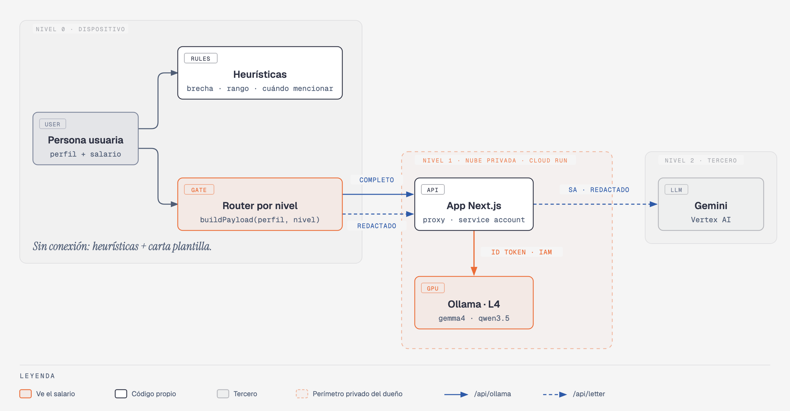

# Cathy — carta dividida con modelos locales

Generador de **carta de interés** (carta de presentación para acompañar el CV) + **nota privada de negociación salarial**, con "cerebro dividido" en tres niveles de confianza:

- las **heurísticas** corren en tu navegador y calculan todos los números;
- un **modelo pequeño** (Gemma 4 E2B o Qwen 3.5 2B) corre en **Ollama sobre Cloud Run**, en el proyecto del dueño y protegido por IAM, y redacta el borrador de la nota y extrae los requisitos de la oferta;
- **Gemini** (`gemini-3.8-flash` vía Vertex AI) escribe la carta, pero solo con un payload redactado que arma código explícito.

Le cuentas tu situación tal cual (puesto, empleador, **salario actual**, puesto y salario deseados y, si quieres, pegas la oferta) y recibes:

1. **Carta de interés** lista para enviar.
2. **Nota privada**: brecha salarial, banda (conservador → agresivo), cómo se compara con el rango publicado, **cuándo mencionar la expectativa** y un borrador en prosa escrito por el modelo local. Las cifras de la nota salen de las heurísticas, nunca del modelo, y cualquier número del borrador que no coincida con lo calculado se marca en rojo.



---

## Qué corre dónde y por qué

| Tier | Dónde | Qué recibe | Qué hace |
|---|---|---|---|
| **0 · Dispositivo** | Tu navegador | Todo | Heurísticas: redactor, brecha y bandas, tipo de cambio, rango de la oferta, regla de "cuándo mencionarlo", idioma, seniority, chequeo de cifras. Nota heurística y carta de plantilla offline. |
| **1 · Nube privada** | Ollama en Cloud Run (GPU L4 o CPU), proyecto `ai-experiments-487722`, `--no-allow-unauthenticated`. Se llega a través del proxy `/api/ollama/*` de esta app | **Perfil completo, incluido el salario actual** | Borrador de la nota de negociación · extracción de requisitos de la oferta (JSON con esquema) |
| **2 · Tercero** | Gemini `gemini-3.8-flash` vía **Vertex AI**, autenticado con la cuenta de servicio (sin API key) | Solo: puesto deseado, empresa objetivo, años de experiencia, logros **redactados**, requisitos extraídos (redactados), nombre para la firma, idioma y seniority | Carta de interés |

**Nunca llega a Gemini:** salario actual, salario deseado (en ninguna forma escrita), empleador actual, correo, teléfono, DPI ni NIT. Lo prueba `tests/leak.test.ts` (ver [Pruebas](#pruebas)).

### Por qué este reparto

| Criterio | Decisión |
|---|---|
| **Privacidad** | Los números sensibles no necesitan un modelo: se calculan en el navegador. Lo que sí necesita lenguaje (el borrador de la nota) va a un modelo **propio**, dentro de un perímetro controlado por IAM, sin terceros. A Gemini solo le llega lo que una carta necesita, ya redactado. |
| **Calidad** | La carta es el texto que lee un reclutador: ahí conviene el mejor modelo. Una nota privada de 150 palabras y una extracción de viñetas se resuelven bien con un modelo de ~2B. |
| **Costo** | Heurísticas: US$0. Ollama en Cloud Run escala a cero (US$0 en reposo) y solo cobra mientras procesa. Gemini se llama una vez por carta con un prompt corto. |
| **Disponibilidad** | Si Ollama no responde (cold start, cuota, caída), la nota sale solo con heurísticas; si Gemini falla, la carta sale de una plantilla determinista. **Offline** la app carga (service worker) y entrega ambas cosas. |
| **Latencia** | Las heurísticas son instantáneas y se muestran primero. El borrador del modelo local llega en streaming; el costo es el cold start de la GPU (~30–60 s) o de CPU (hasta ~2 min), que la UI muestra con honestidad. |

### La decisión de la nube privada (condición 2, reinterpretada)

El enunciado dice que **el salario actual nunca sale del dispositivo**. Cathy lo reinterpreta, a propósito y por escrito:

> **El salario nunca sale del perímetro de confianza —el navegador más los servicios de Cloud Run del propio dueño— y nunca llega a un tercero (Gemini).**

Por qué: los modelos de ~2B que queremos comparar corren con holgura en una L4, pero no en cualquier laptop o teléfono, y para este experimento queríamos medirlos en las mismas condiciones. Ollama en Cloud Run con `--no-allow-unauthenticated` solo acepta ID tokens de identidades con `roles/run.invoker` (la cuenta de servicio de esta app y el dueño), no guarda nada (no hay base de datos ni logs de prompts en la app) y no hay un proveedor externo de por medio.

Lo que **cuesta** esta decisión, y hay que decirlo: ya no es "nunca sale del dispositivo". El dato viaja por la red (TLS) hasta un contenedor en Google Cloud; la confianza pasa a depender de la configuración de IAM del proyecto y de quién administra ese proyecto. Si el requisito fuera literal, habría que correr el modelo en el navegador (WebGPU/transformers.js) o en `ollama serve` local — la app ya soporta esto último: con `OLLAMA_URL=http://localhost:11434` el tier 1 vuelve a ser el dispositivo, sin cambiar una línea de código. La prueba de fuga está escrita para la versión reinterpretada: el salario **puede** aparecer en `/api/ollama/*` y **no puede** aparecer en `/api/letter`. Detalle y alternativas en [`docs/decisiones.md`](docs/decisiones.md).

---

## Cómo se llama a cada componente

### Componente local (tier 0): las heurísticas

Todo vive en `src/lib/heuristics/` y son funciones puras de TypeScript, sin red ni modelo:

```ts
import { parseMoney, salaryGap, extractSalaryRange, whenToMention, redact, detectLanguage, detectSeniority } from "@/lib/heuristics";
import { buildPayload } from "@/lib/router";

parseMoney("Q 15 000");                       // { amount: 15000, currency: "GTQ" }
salaryGap({ amount: 15000, currency: "GTQ" }, { amount: 2500, currency: "USD" });
// { pct: 28.3, band: "ambicioso", desiredGTQ: 19250, ... }   (GTQ_PER_USD = 7.7)

extractSalaryRange("Rango: 13-16k + bono anual");
// { min: 13000, max: 16000, currency: "GTQ", period: "month", ... }

redact("En BANCO industrial gano 15k, escríbeme a ana@correo.gt", { employer: "Banco Industrial, S.A." });
// { text: "En [EMPLEADOR_ACTUAL] gano [MONTO], escríbeme a [CORREO]", findings: [...] }

buildPayload(profile, "third_party", { requirements });   // lo ÚNICO que puede ir a Gemini (zod .strict())
```

El orquestador del cliente (`src/lib/orchestrator.ts`) usa estas funciones y el router (`src/lib/router.ts`), que tiene una **allowlist explícita por tier**.

### Ollama (tier 1)

Desde la app, el navegador llama al proxy del servidor; el prompt se arma en el servidor (el cliente manda datos, no instrucciones) y solo se aceptan los dos modelos de la lista:

```bash
curl -N -X POST http://localhost:3000/api/ollama/requirements \
  -H 'Content-Type: application/json' \
  -d '{"model":"gemma4:e2b-it-qat","offer":"Requisitos:\n- SQL avanzado\n- Power BI"}'
# NDJSON: {"type":"status","phase":"connecting"} … {"type":"delta",…} … {"type":"done","stats":{…},"memory":{"mode":"cpu",…}}
```

Directo a Ollama en Cloud Run (útil para depurar; necesitas `roles/run.invoker`):

```bash
OLLAMA_URL=$(gcloud run services describe ollama-coverletter --region us-central1 --format 'value(status.url)')
curl -N "$OLLAMA_URL/api/chat" \
  -H "Authorization: Bearer $(gcloud auth print-identity-token)" \
  -d '{"model":"qwen3.5:2b","think":false,"stream":true,"options":{"temperature":0},
       "messages":[{"role":"user","content":"Hola"}]}'
curl "$OLLAMA_URL/api/ps" -H "Authorization: Bearer $(gcloud auth print-identity-token)"   # size / size_vram
```

En Cloud Run, la app obtiene el ID token con `google-auth-library` (`GoogleAuth().getIdTokenClient(OLLAMA_URL)`, audience = URL del servicio) desde el metadata server de su cuenta de servicio `coverletter-cathy-app`. En local con credenciales de usuario eso **no funciona** (ADC de usuario no emite ID tokens): usa `OLLAMA_TOKEN=$(gcloud auth print-identity-token)` o, mejor, `gcloud run services proxy` (ver abajo).

### Gemini (tier 2)

`src/lib/server/gemini.ts`, con `@google/genai` en modo Vertex. **No hay API key**: autentica la cuenta de servicio de Cloud Run (`roles/aiplatform.user`) o tu ADC en local.

```ts
const ai = new GoogleGenAI({ vertexai: true, project: "ai-experiments-487722", location: "global" });
await ai.models.generateContent({ model: "gemini-3.8-flash", contents: user, config: { systemInstruction: system } });
```

La ruta `/api/letter` es defensa en profundidad: valida el body con zod `.strict()` (un campo extra como `currentSalary` → 400), **vuelve a correr el redactor** sobre cada texto libre y, si después de redactar queda residuo (p. ej. "quetzales" suelto), responde 422 sin llamar a Gemini.

---

## Por qué cada heurística no necesita un modelo

- **Redactor** (`redactor.ts`): correos, teléfonos GT (8 dígitos, `+502`), DPI (13 dígitos), NIT (`1234567-8`, `123456-K`) y montos tienen formatos cerrados; el empleador actual lo escribió la persona, así que basta buscarlo sin mayúsculas ni tildes, sin sufijo legal, y también por sus palabras distintivas ("Pantaleon" de "Grupo Pantaleon"). Una regex auditada y probada no "decide" dejar pasar un dato; un modelo sí puede.
- **Montos en todos los formatos** (`money.ts`): `Q15,000`, `Q 15 000`, `15000`, `15.000`, `$2,000`, `USD 2000`, `15 mil`, `15k`, `quince mil quetzales`. Es un conjunto finito de patrones. Los montos conocidos (tu salario) se redactan aunque parezcan un año ("2000").
- **Brecha % y bandas** (`gap.ts`): es aritmética más una tabla de umbrales explícita (0–10 conservador, 10–20 razonable, 20–35 ambicioso, 35+ agresivo). Un LLM de 2B se equivoca en porcentajes; esta función no.
- **Tipo de cambio** (`currency.ts`): una constante documentada, `GTQ_PER_USD = 7.7` (referencia aproximada del Banguat 2025–2026), usada solo para comparar magnitudes.
- **Rango salarial de la oferta** (`offer-salary.ts`): las ofertas publican salario con patrones repetidos ("Q8,000 - Q10,000", "entre … y …", "hasta …", "8-10k", "US$36,000 per year"). Si no hay patrón devolvemos `null` en lugar de "estimar". Los montos anuales en GTQ se dividen entre 14 (12 sueldos + aguinaldo + bono 14); en USD, entre 12.
- **Cuándo mencionar la expectativa** (`timing.ts`): una tabla de reglas ordenada (la oferta la pide → rango en el formulario; cae dentro del rango → primera llamada con RR. HH.; sobre el tope → después de la entrevista técnica; salto agresivo sin rango → que ellos pongan la cifra; …). Cada consejo tiene un "porque" revisable y la respuesta no cambia entre corridas.
- **Idioma de la oferta** (`language.ts`): conteo de palabras funcionales es/en; dos clases, margen enorme.
- **Seniority** (`seniority.ts`): palabras clave del título (jr, sr, líder, gerente…) y, si no hay, una tabla de años.
- **Requisitos por viñetas** (`requirements.ts`): respaldo cuando Ollama no responde; toma las viñetas tal cual (cero alucinación).
- **Cifras consistentes** (`consistency.ts`) y **en tema** (`topic.ts`): extraen números del texto del modelo y los comparan con lo calculado; verifican que hable de negociación salarial y no de finanzas (un modelo de 2B leyó "carta de interés" como carta financiera).

---

## Costos

| Pieza | Costo aproximado |
|---|---|
| Heurísticas (navegador) | US$0 |
| Ollama en Cloud Run con **GPU L4** | ≈ US$0.7–1 por hora **activa** (GPU + 8 vCPU + 32 GiB, precios de lista); **US$0 en reposo** (`--min-instances 0`). El costo real es el **cold start**: ~30–60 s arrancando contenedor y cargando el modelo. |
| Ollama en Cloud Run **modo CPU** (mientras no haya cuota de GPU) | ≈ US$0.7 por hora activa (8 vCPU + 32 GiB). Medido: 16–19 tok/s; con el contenedor en cero, 60 s (qwen) a 109 s (gemma) solo de carga del modelo. |
| App Next.js en Cloud Run | Centavos: 1 vCPU / 1 GiB, escala a cero. |
| Gemini `gemini-3.8-flash` | Una llamada por carta, ~600 tokens de entrada y ~400 de salida. |

---

## Cómo correrlo

```bash
npm install
cp .env.example .env.local     # y llena los valores (NUNCA subas tokens)
```

**(a) Con un Ollama local** (tier 1 = tu máquina):

```bash
ollama serve &
ollama pull gemma4:e2b-it-qat && ollama pull qwen3.5:2b
# .env.local
OLLAMA_URL=http://localhost:11434
OLLAMA_MODEL=gemma4:e2b-it-qat
GOOGLE_CLOUD_PROJECT=ai-experiments-487722
GOOGLE_CLOUD_LOCATION=global
GOOGLE_GENAI_USE_VERTEXAI=true
gcloud auth application-default login   # Vertex AI con tu usuario
npm run dev
```

**(b) Contra el Ollama privado de Cloud Run.** Opción recomendada, sin tokens en archivos: un proxy autenticado de gcloud.

```bash
gcloud run services proxy ollama-coverletter --region us-central1 --port 11434
# y en .env.local: OLLAMA_URL=http://localhost:11434
```

Alternativa: `OLLAMA_URL=https://ollama-coverletter-….run.app` y `OLLAMA_TOKEN=$(gcloud auth print-identity-token)` exportado en tu shell (expira en 1 h).

**Producción** (Cloud Run): `./deploy-app.sh` crea la cuenta de servicio `coverletter-cathy-app`, le da `roles/aiplatform.user` y `roles/run.invoker` **solo** sobre `ollama-coverletter`, construye con Cloud Build y despliega `cathy-coverletter` (pública) con las variables de entorno. El Ollama se despliega aparte con `ollama/deploy.sh`.

Variables: `OLLAMA_URL`, `OLLAMA_MODEL` (default del selector), `OLLAMA_TOKEN` (solo dev), `OLLAMA_TIMEOUT_MS` (default 300000), `GOOGLE_CLOUD_PROJECT`, `GOOGLE_CLOUD_LOCATION=global`, `GOOGLE_GENAI_USE_VERTEXAI=true`, `GEMINI_MODEL` (default `gemini-3.8-flash`).

---

## Pruebas

```bash
npm test          # vitest: heurísticas, router por tier, chequeo de cifras, proxy de Ollama, ruta de la carta y FUGA
npm run e2e       # Playwright contra `next build && next start` (APIs simuladas con page.route)
npm run bench -- --dry   # benchmark completo contra un Ollama simulado (sin GPU)
npm run bench            # benchmark real (necesita OLLAMA_URL y ADC para el juez)
```

- **`tests/leak.test.ts`** corre el orquestador real con `fetch` simulado para los 12 perfiles de `bench/inputs/` (con el salario y el empleador además escondidos en los logros, y con un "Ollama" que devuelve requisitos que repiten el salario). Captura cada petición y verifica que el salario (actual y deseado, en todas sus formas: `15000`, `15,000`, `15.000`, `Q15,000`, `Q 15 000`, `15 mil`, `15k`…) y el empleador aparezcan **solo** en `/api/ollama/*` y **nunca** en `/api/letter`. Tiene control positivo (sí los encuentra en `/api/ollama/negotiation`) y se validó por mutación: si se apaga el redactor, fallan 13 pruebas. Además prueba la ruta del servidor con `@google/genai` simulado: aunque un cliente modificado esconda el salario en los logros, lo que llega a Gemini ya está redactado; un campo extra da 400 y el residuo da 422.
- **e2e**: flujo completo (incluido el estado "despertando la GPU"), fallback sin Ollama y **offline**: `context.setOffline(true)` + recarga → la app carga desde el service worker y entrega nota heurística + carta de plantilla sin ninguna petición a `/api/*`.
- **Benchmark**: ver [`BENCHMARK.md`](BENCHMARK.md). Flags: `--runs N`, `--inputs N`, `--models a,b`, `--tasks negotiation,requirements`, `--no-cold`, `--no-judge`, `--dry`, y `--from bench/results/X.json [--rejudge]` para recalcular calidad y juez sin volver a generar.

### Resultado del benchmark (corrida real en CPU, 12 perfiles)

Empate técnico en el agregado, con ganadores distintos por tarea: **qwen3.5:2b escribe mejor la nota** (juez 4.05 vs 3.63; gemma escribió 7 de 12 notas en primera persona) y **gemma4:e2b-it-qat extrae mejor los requisitos** (juez 4.38 vs 3.22; qwen metió la pretensión salarial como "requisito" en 4 de 9). Ninguno inventó cifras frente a las heurísticas. Gemma genera más rápido en CPU (18.6 vs 15.9 tok/s) pero ocupa más memoria (4.05 vs 2.36 GB). Con el contenedor escalado a cero, la primera nota tarda ~1.5–2.5 min en CPU. Detalle y sesgos del juez en [`BENCHMARK.md`](BENCHMARK.md) y [`docs/decisiones.md`](docs/decisiones.md).

**Decisión: gana `gemma4:e2b-it-qat`** (modelo por defecto). El error de Qwen toca la privacidad (mete el salario en los requisitos que después viajan hacia Gemini; el redactor lo atrapó), mientras que el de Gemma es de tono. **Pierde** en la calidad de la nota, en memoria (4.05 vs 2.36 GB) y en carga en frío. Razonamiento completo en [`BENCHMARK.md`](BENCHMARK.md#decisión).

Los 12 perfiles de prueba son **ficticios** (personas inventadas; los nombres de empresas guatemaltecas solo le dan realismo al redactor).

---

## Estructura

```
src/lib/heuristics/   redactor, montos, brecha, tipo de cambio, rango, momento, idioma, seniority, cifras, tema
src/lib/router.ts     buildPayload(profile, tier): allowlists explícitas
src/lib/orchestrator.ts  flujo del cliente (online/offline, fallbacks, bitácora de tiers)
src/lib/prompts.ts    prompts (los usa la app Y el benchmark)
src/app/api/ollama/[task]/route.ts   proxy a Ollama (ID token, stream, timeout 300 s)
src/app/api/letter/route.ts          Gemini vía Vertex (zod strict + redactor + residuo)
public/sw.js          service worker (app shell offline)
bench/                benchmark gemma4:e2b-it-qat vs qwen3.5:2b
ollama/               Dockerfile + deploy del Ollama privado
docs/decisiones.md    decisiones y errores reales
```
