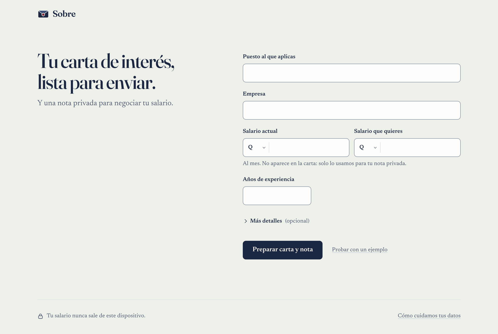
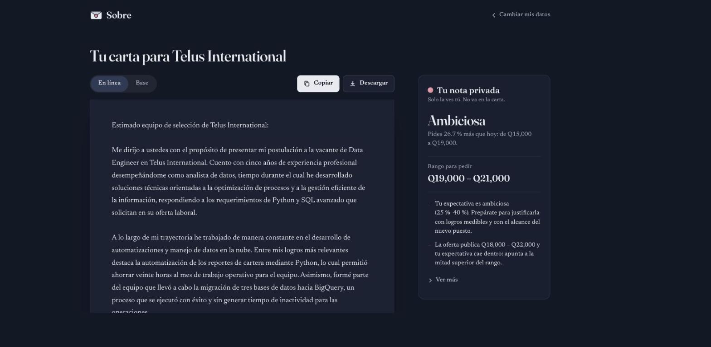
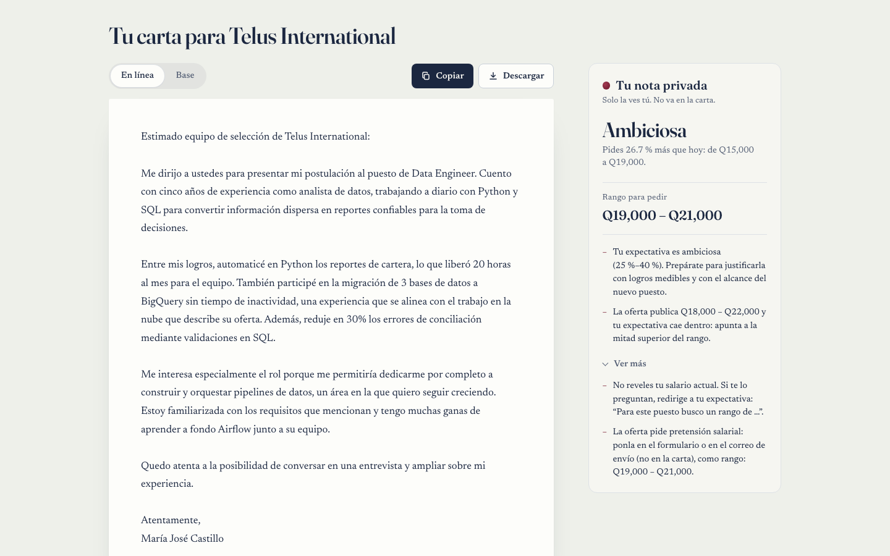
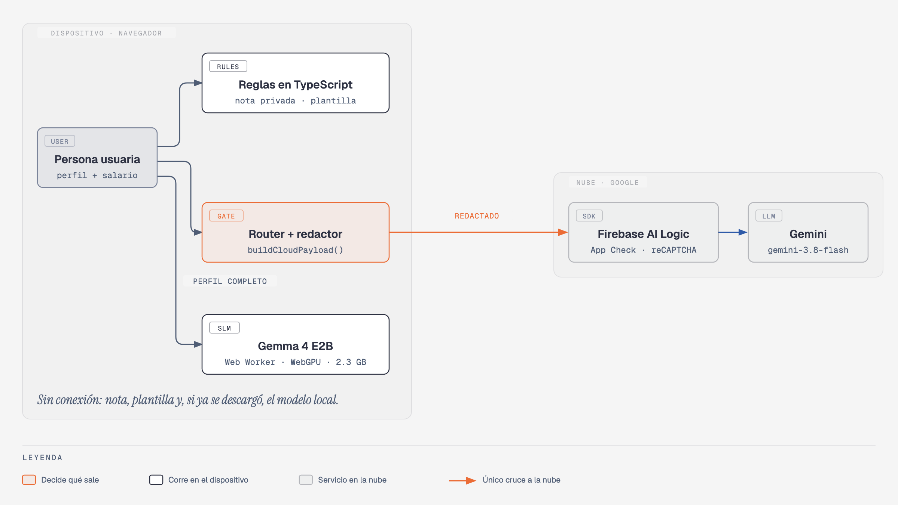

# Emily · carta de interés sin contar lo que ganas

- **Demo:** [sobre-carta.vercel.app](https://sobre-carta.vercel.app)
- **Artículo:** [¿Cómo sé que mi app no filtra tu salario? Validar un split brain con 78 datos trampa](https://docs.google.com/document/d/1sAsfRQllg164OX_fE5ogyDlLKuEZYzil4UbPY0OPntA/edit)
- **Enunciado:** [ENUNCIADO.md](../ENUNCIADO.md)
- **Validación:** [VALIDACION.md](VALIDACION.md) · **Prueba didáctica:** [DIDACTICA.md](DIDACTICA.md) · **Temas para próximos artículos:** [TEMAS.md](TEMAS.md)

Generador de **cartas de interés** con una **nota privada de negociación**, construido como PWA
(Vite + TypeScript). Cuentas tu situación con franqueza, incluido tu salario actual, y la app:

1. te muestra **una** carta: la mejor disponible. Si hay conexión, la versión **en línea** (Gemini);
   si no, la que se escribe **en tu dispositivo** (si descargaste el modelo local), y si no, la versión
   **base** (plantilla). Un selector discreto (*En línea · En tu dispositivo · Base*) aparece solo cuando hay más de una;
2. arma una **nota privada** que dice qué tan realista es tu expectativa y cuándo mencionarla.

**Tu salario actual nunca sale del dispositivo**, y eso lo prueba una prueba automática
(`tests/leak.test.ts`). La evaluación de 18 casos está en [`VALIDACION.md`](VALIDACION.md).

### La interfaz: **Sobre**

Para quien la usa, la app se llama **Sobre** (como el sobre de una carta; lema: *"Tu carta de interés,
lista para enviar."*). La marca es un sobre cerrado con un sello de lacre, y aparece en el encabezado,
el ícono de la pestaña, los íconos de la PWA (`public/icons/`) y la imagen para redes sociales
(`public/og.png`, 1200×630). El nombre del proyecto (`emily/`) no aparece en la interfaz.

La interfaz es deliberadamente simple, con acabado de producto:

- **Formulario**: cinco datos a la vista (puesto, empresa, salario actual, salario que quieres y años de
  experiencia) y el resto bajo **Más detalles (opcional)**. Los montos se formatean al escribir
  (`15000` → `15,000`, teclado numérico), cada campo dice qué le falta justo debajo, **Enter** envía
  cuando todo está completo (y si no, salta al siguiente dato que falta).
- **Carta**: una sola, con el selector de versión solo si hay más de una; **Copiar** (aviso "Copiada") y
  **Descargar** (`carta-<empresa>.txt`). En el celular, esas dos acciones quedan fijas al pie mientras lees.
  Mientras se escribe, un esqueleto con la forma de la carta y una sola línea honesta ("Suele tardar menos
  de un minuto"); si tarda más de 30 s, ofrece la versión base mientras tanto.
- **Nota privada**: al lado de la carta en pantallas anchas, debajo en el celular; compacta, con **Ver más**.
- **Errores y sin conexión**: mensajes tranquilos con un siguiente paso (*Intentar de nuevo*, *Revisar mis
  datos*, *Pedir la versión en línea* cuando vuelve la conexión).
- **Pie**: *"Tu salario nunca sale de este dispositivo."* y **Cómo cuidamos tus datos**, un diálogo corto
  en lenguaje simple (sin nombres técnicos).
- Modo claro y oscuro (según el sistema), contraste AA (bordes de campos ≥ 3:1, texto ≥ 4.5:1), áreas
  táctiles ≥ 44 px, foco visible, `aria-live` para avisos, animaciones sutiles que respetan
  *reducir movimiento*, y una página 404 con la marca (`public/404.html` en Vercel; dentro de la app,
  para rutas servidas por el service worker).

La interfaz tampoco detalla qué se envió a la nube ni qué se tachó. Esa
explicación vive aquí (secciones [1](#1-qué-corre-dónde-y-por-qué) y [8](#8-qué-es-sensible-y-cómo-se-demuestra))
y en las pruebas; en la sección 3.3 se explica cómo verlo con las herramientas del navegador.

| Formulario | Carta | Nota privada |
|---|---|---|
|  |  |  |

Formulario y carta son capturas de producción con datos reales; las `ui-*` las genera `scripts/ui-screenshots.ts` con la nube simulada (textos de prueba). Capturas en móvil (390×844): [formulario en producción](docs/screenshots/produccion-formulario-movil.png) · [`ui-mobile-form.png`](docs/screenshots/ui-mobile-form.png) ·
[`ui-mobile-letter.png`](docs/screenshots/ui-mobile-letter.png) · [`ui-mobile-note.png`](docs/screenshots/ui-mobile-note.png).
Se regeneran con `npx tsx scripts/ui-screenshots.ts` (build de prueba, nube interceptada; `--dark` para
modo oscuro). Los íconos y la imagen para redes, con `npx tsx scripts/make-icons.ts`.

Otros documentos: [`DIDACTICA.md`](DIDACTICA.md) (prueba de este README con alguien que no conocía el
proyecto, y qué se corrigió) y [`TEMAS.md`](TEMAS.md) (tres temas que merecen su propio artículo).

> Esta es la versión de **Emily** (enfoque: validación y didáctica) de un ejercicio con tres
> implementaciones independientes (`../luis`, `../cathy`). Nada de esta carpeta depende de las otras.

---

## Índice

1. [Qué corre dónde y por qué](#1-qué-corre-dónde-y-por-qué)
- [Quién puede seguir este README](#quién-puede-seguir-este-readme)
2. [Requisitos previos](#2-requisitos-previos-versiones-exactas)
3. [Correr la app paso a paso](#3-correr-la-app-paso-a-paso)
4. [Pruebas](#4-pruebas)
5. [Evaluación (18 casos)](#5-evaluación-18-casos)
6. [Cómo se llama al modelo local](#6-cómo-se-llama-al-modelo-local)
7. [Cómo se llama a Gemini con Firebase AI Logic](#7-cómo-se-llama-a-gemini-con-firebase-ai-logic)
8. [Qué es sensible y cómo se demuestra](#8-qué-es-sensible-y-cómo-se-demuestra)
9. [Funcionamiento sin conexión](#9-funcionamiento-sin-conexión)
10. [Estructura del proyecto](#10-estructura-del-proyecto)
11. [Despliegue](#11-despliegue)
12. [Solución de problemas](#12-solución-de-problemas)

---

## 1. Qué corre dónde y por qué



| Componente | Dónde corre | Tecnología | Por qué ahí |
|---|---|---|---|
| Formulario, **redactor** de datos sensibles, **router** (qué sale a la nube), **nota de negociación**, **carta plantilla** | Navegador (hilo principal) | TypeScript puro (`src/lib/`) | **Privacidad**: el salario y el empleador no necesitan salir para calcular la nota. **Disponibilidad**: funciona sin internet. **Costo**: cero. |
| Versión **en tu dispositivo** (borrador local) de la carta | Navegador, dentro de un **Web Worker** | [transformers.js](https://huggingface.co/docs/transformers.js) 4.3.0 con `onnx-community/gemma-4-E2B-it-qat-mobile-ONNX` (q2f16), WebGPU con respaldo WASM | **Privacidad**: recibe el perfil completo porque nada sale del equipo. **Disponibilidad**: una vez descargado funciona offline. **Costo**: cero por carta. |
| Versión **en línea** (carta de la nube) | Google (Gemini) | `gemini-3.8-flash` vía **Firebase AI Logic** (`firebase/ai`, `GoogleAIBackend`), sin servidor propio | **Calidad**: el modelo grande escribe mejor (ver [`VALIDACION.md`](VALIDACION.md)). Recibe **solo** lo que decide el router, ya tachado. |

Criterios del ejercicio que cubre esta división: **privacidad**, **disponibilidad**, **costo** y **calidad**.

El flujo de un clic en **"Preparar carta y nota"** (`src/lib/orchestrator.ts`):

1. **Local, siempre:** nota de negociación + carta plantilla (instantáneo, también offline).
2. **Router** (`src/lib/router.ts` → `buildCloudPayload(profile)`): lista blanca de campos → redactor → compuerta final.
3. Si la compuerta no encontró nada y hay conexión: **nube** (`src/lib/cloud.ts`) → la carta vuelve con `{{NOMBRE}}` y el nombre se pone **en el dispositivo**.
4. **Borrador local** (si el modelo está descargado): el worker escribe la carta con el perfil completo.
   Se escribe solo cuando no hay versión en línea (sin conexión, error o bloqueo); si la hay, se escribe
   cuando eliges *En tu dispositivo* en el selector de versión.

La UI (`src/main.ts`) muestra una sola carta, en este orden de preferencia: **en línea → en tu
dispositivo → base**. Los errores se traducen a lenguaje simple (por ejemplo, un `401` de App Check
se ve como *"No pudimos escribir la versión en línea esta vez. Te dejamos la versión base."*, con un
botón *Intentar de nuevo*); el detalle técnico queda en la consola del navegador con el prefijo `[sobre]`.

## Quién puede seguir este README

- **App, nota, plantilla, modelo local, modo sin conexión y pruebas:** cualquiera con acceso de lectura
  al repositorio privado **`ykro/coverletter-gen`**. No hace falta ninguna cuenta.
- **Versión en línea (carta de la nube):** además, ser miembro del proyecto de Firebase
  **`viaticos-spending-mngmt`** (para leer la configuración web y la clave de App Check).
- **Evaluación completa (`npm run eval`):** además, acceso a un proyecto de Vertex AI (ver [§5](#5-evaluación-18-casos)).

Si no tienes acceso a Firebase, **sáltate los pasos 3.1 y 3.2**: la app arranca igual y muestra la
versión base, la nota privada y la opción de descargar el modelo local; también funciona sin conexión.

## 2. Requisitos previos (versiones exactas)

Probado con estas versiones en macOS 26 (Apple Silicon). Versiones más nuevas probablemente funcionen, pero estas son las verificadas:

| Herramienta | Versión probada | Para qué | Cómo verificar |
|---|---|---|---|
| Node.js | **24.21.0** (mínimo 20.19) | todo | `node -v` |
| npm | **12.0.2** | instalar dependencias | `npm -v` |
| Chromium de Playwright | build **1243** (viene con `@playwright/test` 1.63.0; la primera descarga pesa ~150 MB) | pruebas e2e | `npx playwright install chromium` |
| Firebase CLI | 15.6.0 (opcional) | obtener la configuración web | `firebase --version` |
| Google Cloud CLI | 586.0.0 (para `npm run eval` completo y, opcionalmente, para leer la clave de reCAPTCHA) | credenciales ADC para Vertex AI | `gcloud --version` |
| Navegador para usar la app | Chrome/Edge 113+ (WebGPU) | borrador local rápido | `chrome://gpu` → "WebGPU: Hardware accelerated" |

Dependencias principales (fijadas en `package-lock.json`): `@huggingface/transformers` 4.3.0 · `firebase` 12.19.0 · `vite` 8.3.1 · `vite-plugin-pwa` 1.3.0 · `vitest` 5.0.2 · `@playwright/test` 1.63.0 · `@google/genai` 2.24.0 · `typescript` 7.0.2 · `tsx` 4.23.15.

Espacio en disco: ~850 MB para `node_modules`; **2.3 GB** adicionales si descargas el modelo local (en el navegador y, aparte, en `.cache/transformers` si corres la evaluación completa).

## 3. Correr la app paso a paso

Todos los comandos se corren **dentro de la carpeta `emily/`**.

```bash
cd emily
npm ci                     # instala exactamente lo del package-lock.json
cp .env.example .env.local # crea tu archivo de configuración local (no se sube a git)
```

Con npm 12, `npm ci` avisa que bloqueó los *install scripts* de 6 paquetes: `@firebase/util`,
`@google/genai`, `esbuild`, `fsevents`, `onnxruntime-node` y `protobufjs`. Es lo esperado y **no hace
falta aprobarlos**: todo funciona sin ellos.

### 3.1 Configurar Firebase (para la carta de la nube)

La app necesita la configuración web de la app de Firebase **`coverletter-emily`** del proyecto
**`viaticos-spending-mngmt`**. Esos valores **no están en el repositorio**: se leen de variables de entorno de Vite.

```bash
firebase login                                              # si no lo has hecho
firebase apps:list WEB --project viaticos-spending-mngmt    # copia el App ID de "coverletter-emily"
firebase apps:sdkconfig WEB <APP_ID> --project viaticos-spending-mngmt
```

El último comando imprime un JSON con 9 campos. Copia **estos 7** a `.env.local` (ignora
`projectNumber` y `version`, que la app no usa):

| Campo de `firebaseConfig` | Variable en `.env.local` |
|---|---|
| `apiKey` | `VITE_FIREBASE_API_KEY` |
| `authDomain` | `VITE_FIREBASE_AUTH_DOMAIN` |
| `projectId` | `VITE_FIREBASE_PROJECT_ID` |
| `storageBucket` | `VITE_FIREBASE_STORAGE_BUCKET` |
| `messagingSenderId` | `VITE_FIREBASE_MESSAGING_SENDER_ID` |
| `appId` | `VITE_FIREBASE_APP_ID` |
| `measurementId` | `VITE_FIREBASE_MEASUREMENT_ID` |

Atajo opcional: este comando imprime las 7 líneas listas para pegar en `.env.local` (reemplaza `<APP_ID>`):

```bash
firebase apps:sdkconfig WEB <APP_ID> --project viaticos-spending-mngmt | node -e '
let s = ""; process.stdin.on("data", (d) => (s += d)).on("end", () => {
  const c = JSON.parse(s.slice(s.indexOf("{"), s.lastIndexOf("}") + 1));
  const keys = { apiKey: "API_KEY", authDomain: "AUTH_DOMAIN", projectId: "PROJECT_ID", storageBucket: "STORAGE_BUCKET",
    messagingSenderId: "MESSAGING_SENDER_ID", appId: "APP_ID", measurementId: "MEASUREMENT_ID" };
  for (const [k, v] of Object.entries(keys)) console.log(`VITE_FIREBASE_${v}=${c[k] ?? ""}`);
});'
```

> La `apiKey` de Firebase web identifica la app, no autoriza nada por sí sola; aun así, por regla
> del proyecto no se commitea. La protección contra abuso es **App Check** (siguiente paso).

### 3.2 App Check (obligatorio para la versión en línea en este proyecto)

El proyecto de Firebase tiene **App Check en modo obligatorio** para Firebase AI Logic. Sin App Check
la carta de la nube falla con `401 Firebase App Check token is invalid`: la app muestra *"No pudimos
escribir la versión en línea esta vez. Te dejamos la versión base."* y el resto funciona igual. Hay dos opciones:

- **Clave de reCAPTCHA Enterprise (recomendada, sirve en desarrollo y en producción):** ya existe una
  clave de sitio para la app web **`coverletter-emily`**, que acepta los dominios
  `sobre-carta.vercel.app` y `localhost`. No está en el repositorio; obtenla así (o pídesela a la dueña del proyecto):

  ```bash
  gcloud recaptcha keys list --project viaticos-spending-mngmt
  # busca la clave con displayName "coverletter-emily"; su id (el final de "name") es la clave de sitio
  ```

  y ponla en `.env.local`: `VITE_RECAPTCHA_ENTERPRISE_KEY=<clave de sitio>`. Con eso, la versión en
  línea funciona en `npm run dev` sin token de depuración. En Vercel va la misma variable.
- **Token de depuración (alternativa para desarrollo):**
  1. Consola de Firebase → *App Check* → pestaña *Apps* → `coverletter-emily` → menú ⋮ → *Administrar tokens de depuración* → *Agregar token de depuración* → *Generar* y copiarlo.
  2. En `.env.local`: `VITE_APPCHECK_DEBUG_TOKEN=<el token>`.
  3. Solo lo usa `npm run dev`; un build de producción lo ignora. Si están las dos variables, gana el token de depuración.

Deja la **aplicación obligatoria** de App Check activada para *Firebase AI Logic*: sin ella cualquiera
podría usar tu cuota de Gemini con la configuración pública de la app. Para crear una clave nueva en otro
proyecto: habilitar la API *reCAPTCHA Enterprise*, crear una clave de sitio web con tus dominios y
registrarla en Firebase → *App Check* → tu app → proveedor *reCAPTCHA Enterprise*.

### 3.3 Arrancar

```bash
npm run dev
```

Abre **http://localhost:5173**. Pruébala así:

1. Toca **"Probar con un ejemplo"** (perfil ficticio, junto al botón) y luego **"Preparar carta y nota"**.
   El formulario muestra solo cinco datos; nombre, puesto y empleador actuales, logros, oferta y la opción
   de no usar internet están bajo **Más detalles (opcional)** (el ejemplo también los llena).
2. Verás **una carta** y, debajo, tu **nota privada**: veredicto, una frase, el *Rango para pedir* y dos
   consejos; el resto está en **Ver más**. Si configuraste Firebase + App Check, la carta es la versión
   *En línea*; si no, la versión *Base*. La nota aparece al instante.
3. Con el selector de versión (solo aparece si hay más de una) pasa de *En línea* a *Base* y de vuelta;
   **"Copiar"** copia la que estás viendo (aviso *"Copiada"*) y **"Descargar"** la guarda como `.txt`.
4. *(Para ver qué salió del dispositivo)* abre las herramientas del navegador → *Network*, filtra por
   `firebasevertexai` y vuelve a preparar la carta: en el cuerpo de la petición no aparece `Q15,000`, ni
   "Banco Industrial", ni "Ana López", y tu nombre viaja como `{{NOMBRE}}`.
5. *(Opcional)* Al final de la página, toca **"Usar sin internet (2.3 GB)"**. La línea se convierte en una
   barra de progreso; la primera vez tarda (depende de tu conexión); después queda en caché, aparece la
   versión *En tu dispositivo* y funciona sin conexión.

Sin `.env.local` la app arranca igual: muestra la versión base, la nota y la opción de descargar el modelo local.
Si prefieres no usar internet para la carta, en el formulario abre **Más detalles** → *No usar internet para escribir la carta*.

## 4. Pruebas

```bash
npm test                         # vitest: unitarias + prueba de fugas (≈2 s, sin red)
npx playwright install chromium  # solo la primera vez
npm run e2e                      # Playwright contra `vite build && vite preview` (≈5 s de pruebas + el build); alias de `npm run test:e2e`
npm run typecheck                # TypeScript estricto
```

| Archivo | Qué prueba |
|---|---|
| `tests/unit/redact.test.ts` | cada tipo del redactor (montos en todas sus formas, correo, teléfono GT, DPI, NIT, direcciones, empleador con tildes/acrónimo/typos, personas) + regresiones encontradas por la evaluación |
| `tests/unit/router.test.ts` | lista blanca, qué sale y qué no, registro de tachaduras, compuerta final |
| `tests/unit/negotiation.test.ts` | brecha %, bandas, conversión USD↔GTQ, rango de la oferta (regex), reglas de cuándo mencionarlo |
| `tests/unit/template.test.ts` | carta plantilla (250–400 palabras, sin datos sensibles) y verificaciones de carta |
| `tests/leak.test.ts` | **orquestador completo** para 4 perfiles, con (A) el límite de la nube espiado y (B) el SDK real de Firebase con `fetch` simulado: el salario en todas sus formas y el empleador nunca aparecen en lo que sale |
| `tests/e2e/app.spec.ts` | en desktop y móvil: flujo completo (formulario de cinco datos con *Más detalles* plegado, sin scroll horizontal, una sola carta visible, selector de versión, nota privada con *Ver más*, descarga opcional del modelo simulado; la nube interceptada no recibe salario, empleador ni nombres), carta y nota con solo los cinco datos visibles (montos formateados al escribir, Enter envía), bloqueo por la compuerta (con *Revisar mis datos*), error `401` de la nube explicado en lenguaje simple (con *Intentar de nuevo*), formulario incompleto (mensaje por campo), **`context.setOffline(true)` + recarga** → nota y carta base siguen funcionando, **Copiar** (aviso *Copiada* y contenido del portapapeles) y **Descargar** (`.txt`), marca *Sobre* sin el nombre de la creadora (página, título, manifiesto, diálogo de privacidad) y página 404 |
| `tests/unit/format.test.ts` | formato de montos al escribir (cursor, pegado con centavos, símbolos) y nombre del archivo descargado |

Las e2e usan un build especial (`VITE_TEST_MODE=1`) donde el modelo local es un sustituto instantáneo
(no descarga 2.3 GB) y el endpoint de Firebase AI Logic se intercepta con `page.route`, de modo que corre
el SDK real pero ninguna petición llega a Google. No necesitan `.env.local`.

## 5. Evaluación (18 casos)

```bash
npm run eval -- --leaks-only   # solo fugas y falsos positivos, sin modelos (≈1 s)
gcloud auth application-default login   # una vez, para Vertex AI
npm run eval                   # completa: fugas + cartas local/nube/plantilla + juez (≈35 min la primera vez)
```

Salida esperada de `npm run eval -- --leaks-only` (termina con esta línea):

```
Recall redactor 84.6 % · recall final 84.6 % · FP 0/101 · salario actual en payload: 0 casos
```

- **12 fugas** en la lista de casos: es lo esperado, no un fallo. Son datos trampa *difíciles* plantados a propósito
  (apodos como "don Beto", "doce y medio", correos deletreados) y están explicados en [`VALIDACION.md`](VALIDACION.md) §2.4.
- **0 falsos positivos** de 101 textos que no deben tacharse.
- **`salario actual en payload: 0 casos`** es el número que **nunca** debe cambiar: si alguna vez es mayor que 0,
  hay una fuga real del salario actual.
- Escribe `eval/results/<fecha>-leaks.json` y `.md` (ignorados por git); no toca `VALIDACION.md`.

- Casos: `eval/fixtures/*.json` (perfil + `canaries`, los datos trampa, con tipo y dificultad + `allowed`).
- Criterios de calidad y sesgos del juez: [`eval/CRITERIOS.md`](eval/CRITERIOS.md).
- Resultados crudos: `eval/results/<fecha>.json`. Reporte: **[`VALIDACION.md`](VALIDACION.md)** (se regenera solo; también con `npm run eval:report`).
- Opciones: `--only=01,07` · `--device=cpu` · `--fresh` (ignora la caché de cartas en `.cache/eval-letters`) · `--skip-local` · `--skip-cloud` · `--skip-judge`.
- La primera corrida completa descarga el modelo local a `.cache/transformers` (2.3 GB).
- La nube de la evaluación usa **Vertex AI** (`@google/genai`, región `global`) con el **mismo modelo y el mismo prompt** que la app, porque Firebase AI Logic es un SDK de navegador protegido con App Check. El proyecto sale de la variable **`VERTEX_PROJECT`** (por defecto `ai-experiments-487722`); si tu cuenta no tiene acceso a ese, usa uno tuyo con Vertex AI habilitado: `VERTEX_PROJECT=mi-proyecto npm run eval`.

## 6. Cómo se llama al modelo local

El modelo vive en un **Web Worker** (`src/worker/local-llm.worker.ts`) para no congelar la página.
La página lo usa con un cliente pequeño (`src/lib/local-llm-client.ts`):

```ts
import { createLocalLlm } from './lib/local-llm-client';
import { buildLetterPrompt, localLetterInput } from './lib/prompt';

const llm = createLocalLlm({
  onEvent: (e) => {
    if (e.type === 'progress') console.log(`${(e.loaded / 1e9).toFixed(2)} / ${(e.total / 1e9).toFixed(2)} GB`);
    if (e.type === 'ready') console.log('listo en', e.device); // 'webgpu' o 'wasm'
  },
});

await llm.load(); // descarga ~2.3 GB la primera vez; después sale de Cache Storage
const carta = await llm.generate(buildLetterPrompt(localLetterInput(perfil)), (trozo) => mostrar(trozo));
```

Protocolo de mensajes (`src/worker/protocol.ts`):

| Página → worker | Worker → página |
|---|---|
| `{ type: 'load' }` | `{ type: 'device', device }` · `{ type: 'progress', loaded, total, progress }` · `{ type: 'ready', device, loadMs }` |
| `{ type: 'generate', id, prompt: { system, user } }` | `{ type: 'token', id, text }` (streaming) · `{ type: 'done', id, text, ms }` · `{ type: 'error', id?, message }` |

La misma función que usa el worker (`createLocalGenerator` en `src/lib/local-model.ts`) funciona en Node, así la usa la evaluación:

```ts
import { createLocalGenerator } from './src/lib/local-model';
const gen = await createLocalGenerator({ device: 'webgpu' }); // o 'cpu'
const texto = await gen.generate({ system: '…', user: '…' });
```

Detalle no obvio: el repositorio ONNX trae la plantilla de chat como `chat_template.jinja`, que el
tokenizador del pipeline `text-generation` no lee. `createLocalGenerator` la obtiene con
`Gemma4Processor.from_pretrained()` y la pasa explícitamente (ver `docs/decisiones.md`).

## 7. Cómo se llama a Gemini con Firebase AI Logic

Todo está en `src/lib/firebase.ts` (inicialización perezosa + App Check) y `src/lib/cloud.ts`
(el único módulo que habla con la nube; recibe un prompt ya armado, **nunca el perfil**):

```ts
import { initializeApp } from 'firebase/app';
import { getAI, getGenerativeModel, GoogleAIBackend } from 'firebase/ai';

const app = initializeApp(firebaseConfig);                         // valores de VITE_FIREBASE_*
// (opcional pero recomendado) initializeAppCheck(app, { provider: new ReCaptchaEnterpriseProvider(key) })
const ai = getAI(app, { backend: new GoogleAIBackend() });
const model = getGenerativeModel(ai, {
  model: 'gemini-3.8-flash',
  systemInstruction: prompt.system,
  generationConfig: { temperature: 0.7, topP: 0.95, maxOutputTokens: 4096 },
});
const result = await model.generateContent(prompt.user);  // prompt = buildCloudPayload(perfil).prompt
console.log(result.response.text());
```

No hay servidor propio ni llave en el código: la petición va del navegador a
`firebasevertexai.googleapis.com`, autenticada con la configuración de la app y el token de App Check.

## 8. Qué es sensible y cómo se demuestra

| Dato | Tratamiento | Prueba |
|---|---|---|
| **Salario actual** (campo) | Nunca se copia al payload (no está en la lista blanca). Lo usa solo la nota local. | `tests/leak.test.ts`, `tests/unit/router.test.ts`, e2e, evaluación |
| Salario escrito en texto libre (`Q15,000`, `Q 15 000`, `15.000`, `15000`, `$2,000`, `USD 2000`, `15 mil`, `15k`, `quince mil`) | Redactor → `[SALARIO]`; la compuerta además busca el salario **conocido** del usuario en todas sus formas y bloquea si aparece | `tests/unit/redact.test.ts`, `tests/leak.test.ts` |
| **Empleador actual** | Campo excluido; en texto libre se tacha (sin mayúsculas ni tildes, acrónimo, alias entre paréntesis, sin espacios, con un error de dedo) → `[EMPLEADOR_ACTUAL]` | ídem |
| Nombres de terceros ("mi jefa Ana López", "Lic. …") | → `[PERSONA]` | `tests/unit/redact.test.ts` |
| Tu nombre | Viaja como `{{NOMBRE}}` y se restituye en el dispositivo | `tests/leak.test.ts` |
| Correos, teléfonos GT (8 dígitos, +502), DPI (4-5-4), NIT, direcciones (zona N, calle, avenida, colonia, km…) | → `[CORREO]`, `[TELÉFONO]`, `[DPI]`, `[NIT]`, `[DIRECCIÓN]` | `tests/unit/redact.test.ts` |
| Salario deseado | Solo lo usa la nota local; la carta nunca menciona cifras | `tests/unit/router.test.ts` |

Lo que decide qué sale es **código explícito y probado** (`buildCloudPayload`), no un modelo. El redactor
es determinista (expresiones regulares y comparación de texto): tiene límites conocidos y medidos
— ver la tabla de fugas por tipo en [`VALIDACION.md`](VALIDACION.md). La app no muestra ese detalle en
pantalla (la interfaz se mantiene simple); para inspeccionar lo que sale, usa la pestaña *Network* del
navegador (sección 3.3) o las pruebas. Quien no quiera usar internet para la carta tiene la opción
*Más detalles → No usar internet para escribir la carta* en el formulario.

No se guarda nada en `localStorage`: al recargar, el formulario queda vacío.

## 9. Funcionamiento sin conexión

- **App shell**: el service worker de `vite-plugin-pwa` precachea HTML, JS, CSS, fuentes e íconos.
- **Modelo local**: transformers.js lo guarda en *Cache Storage* (`transformers-cache`) la primera vez, junto con el runtime de ONNX (que baja de `cdn.jsdelivr.net`; es un archivo estático, no lleva datos tuyos).
- **Sin conexión y sin modelo descargado**: nota de negociación + carta plantilla.
- **Sin conexión y con el modelo descargado**: además, el borrador local.

## 10. Estructura del proyecto

```
emily/
├── index.html                  # maquetación: paso 1 (tus datos) y paso 2 (tu carta + nota)
├── src/
│   ├── main.ts                 # UI (vanilla TS): formulario de 5 datos + "Más detalles", una carta, nota, "Usar sin internet"
│   ├── styles.css
│   ├── firebase-config.ts      # lee VITE_FIREBASE_* (sin valores en el repo)
│   ├── lib/
│   │   ├── types.ts  money.ts  text.ts
│   │   ├── redact.ts           # redactor determinista
│   │   ├── router.ts           # buildCloudPayload: lista blanca + redactor + compuerta
│   │   ├── prompt.ts           # constructor de prompt ÚNICO (local, nube y evaluación)
│   │   ├── negotiation.ts      # nota privada (reglas fijas)
│   │   ├── template.ts         # carta plantilla
│   │   ├── letter-checks.ts    # verificaciones deterministas de la carta (las usa la evaluación)
│   │   ├── orchestrator.ts     # un clic: nota + plantilla + nube
│   │   ├── cloud.ts  firebase.ts          # Firebase AI Logic + App Check
│   │   └── local-model.ts  local-model-meta.ts  local-llm-client.ts
│   ├── worker/                 # Web Worker del modelo local
│   └── ui/                     # example.ts (perfil ficticio) · format.ts (montos al escribir, nombre del .txt)
├── tests/                      # vitest (unit + leak) y Playwright (e2e)
├── eval/                       # evaluación: fixtures, run.ts, report.ts, CRITERIOS.md, results/
├── public/                     # favicon.svg, icons/ (PWA), og.png (redes sociales), 404.html (Vercel)
├── scripts/                    # verificaciones manuales (modelo en Node/navegador, llamada real a la nube), make-icons.ts, ui-screenshots.ts
├── docs/decisiones.md          # decisiones y errores reales
├── docs/screenshots/ui-*.png   # capturas de la interfaz (desktop 1440×900 y móvil 390×844)
├── DIDACTICA.md  TEMAS.md      # prueba didáctica del README · temas para artículos
└── VALIDACION.md               # reporte generado por la evaluación
```

## 11. Despliegue

Es un sitio estático: `npm run build` genera `dist/`. En Vercel: framework *Vite*, comando `npm run build`,
salida `dist`, y las variables `VITE_FIREBASE_*` (+ `VITE_RECAPTCHA_ENTERPRISE_KEY`) en *Environment Variables*.
**No** definas `VITE_APPCHECK_DEBUG_TOKEN` en Vercel. `vercel.json` evita que el service worker quede cacheado.
Las etiquetas Open Graph usan una URL absoluta para `og.png`: en Vercel se toma sola de
`VERCEL_PROJECT_PRODUCTION_URL` (o define `SITE_URL`, p. ej. un dominio propio de *Sobre*). Las rutas
desconocidas reciben `public/404.html` con estado 404.

## 12. Solución de problemas

| Síntoma | Causa | Solución |
|---|---|---|
| La app dice *"No pudimos escribir la versión en línea esta vez. Te dejamos la versión base."* y la consola muestra `401 … Firebase App Check token is invalid` | El proyecto exige App Check para Firebase AI Logic | Sección [3.2](#32-app-check-obligatorio-para-la-versión-en-línea-en-este-proyecto): `VITE_RECAPTCHA_ENTERPRISE_KEY` (o un token de depuración en dev) |
| Nunca aparece la versión *En línea*, ni mensaje de error | Falta `.env.local` o alguna `VITE_FIREBASE_*` (sin configuración la app no intenta la nube), o marcaste *Más detalles → No usar internet* | Paso [3.1](#31-configurar-firebase-para-la-carta-de-la-nube); reinicia `npm run dev` después de editar `.env.local` |
| `npm ci` muestra *"install scripts blocked"* (npm 12) | npm 12 bloquea scripts de instalación por defecto | No hace falta aprobarlos: `onnxruntime-node` y `esbuild` ya traen sus binarios. Si algo falla, `npm install-scripts approve <paquete>` |
| `npm ci` falla con `EACCES … _cacache` | Caché de npm con permisos de otro usuario | `npm ci --cache /tmp/npm-cache` (o arregla los permisos de `~/.npm`) |
| Junto a *"Usar sin internet"* dice que en este navegador sería lenta | El navegador no tiene WebGPU | Usa Chrome/Edge reciente; revisa `chrome://gpu`. Si igual tocas *"Usar sin internet"*, funciona en WASM, pero puede tardar minutos por carta |
| La descarga del modelo se corta o no avanza | Conexión inestable, o recargaste la página (en `npm run dev`, guardar un archivo recarga la página y mata el worker) | Toca *"Intentar de nuevo"*: los archivos ya completos quedan en caché |
| `Cannot use apply_chat_template() because tokenizer.chat_template is not set` | Usar el pipeline de transformers.js directamente con este repo ONNX | Usa `createLocalGenerator` (carga la plantilla con `Gemma4Processor`) |
| `npm run e2e` dice que falta el navegador | Chromium de Playwright no instalado | `npx playwright install chromium` |
| `npm run e2e` dice que el puerto 4173 está ocupado | Otro `vite preview` corriendo | Ciérralo (`lsof -i :4173`) |
| `npm run eval` falla con `Could not load the default credentials` | Falta ADC | `gcloud auth application-default login` |
| `npm run eval` muestra `429 RESOURCE_EXHAUSTED` | Cuota de Vertex compartida | Se reintenta solo con espera exponencial; si persiste, espera unos minutos (las cartas ya generadas quedan en caché) |
| `npm run eval` tarda mucho en *local* | Corre en CPU (sin WebGPU en Node) | Es normal: ~1.4 tokens/s en CPU vs ~22 en WebGPU en un Mac M-series. Puedes usar `--skip-local` |
| La prueba offline falla en e2e | El service worker no llegó a controlar la página | La prueba espera `controllerchange`; si cambiaste `vite.config.ts`, verifica que `registerType: 'autoUpdate'` siga activo |
