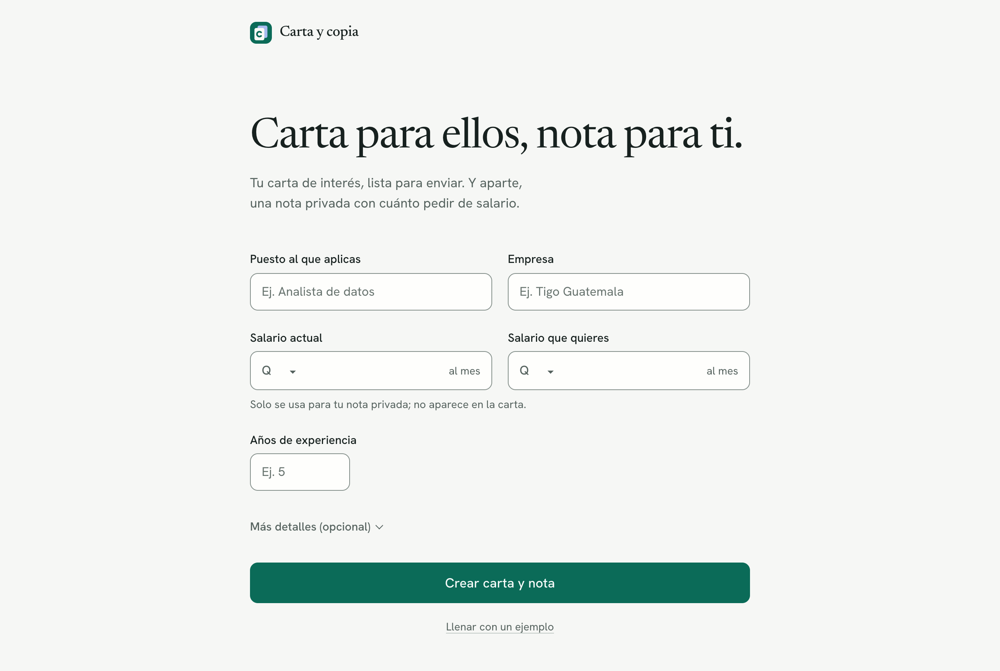
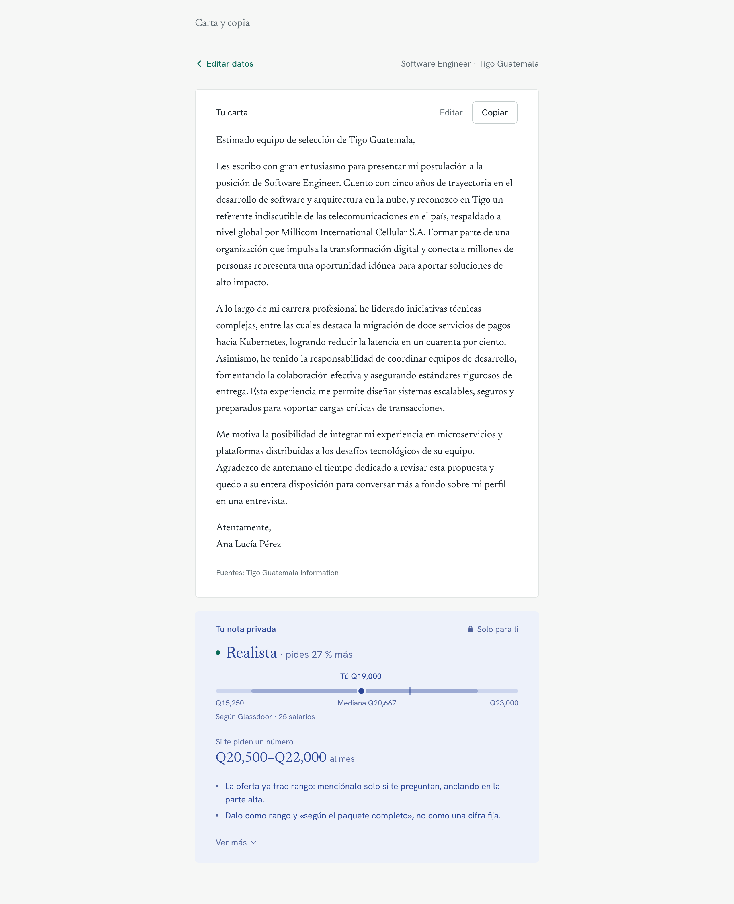
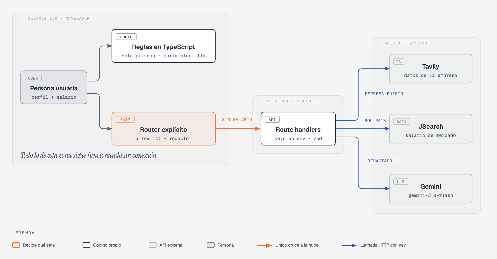

# Carta y copia — generador de cartas de interés "split-brain" (Luis · APIs)

- **Demo:** [carta-y-copia.vercel.app](https://carta-y-copia.vercel.app)
- **Artículo:** [Tres APIs y un secreto: cómo armé un generador de cartas de interés con split brain](https://docs.google.com/document/d/1UZEGQl8GFLdBWTVXL1-3dNgW7zBD2fjXyxd5PWXmhUA/edit)
- **Enunciado:** [ENUNCIADO.md](../ENUNCIADO.md)

PWA en Next.js (App Router, runtime Node) que, a partir de tu situación real —incluido tu salario actual—, genera:

1. **La carta de interés** (el "original"): lista para enviar junto al CV. La escribe Gemini con datos limpios y cita 1–2 hechos verificables de la empresa (con la URL de la fuente visible).
2. **La copia privada** (la "copia al carbón"): una nota de negociación que dice qué tan realista es tu expectativa frente a tu salario actual, frente al mercado (JSearch) y frente al rango de la oferta, y **cuándo** mencionarla. Se calcula en el navegador y **nunca sale de tu dispositivo**.

La interfaz está pensada para quien busca trabajo, no para ingenieros: no muestra proveedores, estados de API ni payloads. Lo que viaja y lo que se queda se explica aquí (y se prueba en `tests/leak.test.ts` y en el e2e con intercepción de red), no en la pantalla. En la app queda una sola línea de tranquilidad junto al salario: *"Tu salario no sale de tu dispositivo"*.

## Cómo se ve

| Formulario | Carta y nota privada |
|---|---|
|  |  |

Capturas de producción con datos reales; en móvil: [formulario](docs/screenshots/produccion-formulario-movil.png). Las capturas `ui-*` las genera `scripts/screenshots.mjs` con las APIs simuladas (sus textos son de prueba): [móvil](docs/screenshots/ui-mobile-results.png), [modo oscuro](docs/screenshots/ui-desktop-results-dark.png). En producción, con Tavily y JSearch reales: [formulario](docs/screenshots/produccion-formulario.png) y [resultados](docs/screenshots/produccion-resultados.png).

**Marca.** "Carta y copia" es el producto: una hoja (la carta, con una "c") sobre su copia al carbón, en un cuadro jade. El mismo trazo se usa en el encabezado, el favicon (`public/icon.svg`), los íconos de la PWA (normal, *maskable* y Apple) y la imagen para compartir de 1200×630 (`public/og.png`); todo sale de `node scripts/make-icons.mjs`. Los metadatos (título, descripción, `og:*`, `twitter:card`, `theme-color` claro/oscuro) y el manifiesto solo nombran el producto.

**Formulario.**
- Una columna: título, una línea de subtítulo y **cinco campos a la vista**: puesto, empresa, salario actual, salario que quieres (Q o US$) y años de experiencia. Nombre, logros, oferta pegada, puesto y empleador actual y ubicación van plegados en "Más detalles (opcional)".
- Los montos se agrupan mientras escribes (`15000` → `15,000`, sin mover el cursor), con teclado numérico en móvil (`inputmode`), sufijo "al mes" y `autocomplete` donde tiene sentido (nombre, puesto y empleador actuales). Años: solo dígitos.
- Validación en línea al salir de un campo (nunca en un campo vacío que solo recorriste) y al enviar: el foco va al primer error. Enter envía; en los campos largos, Ctrl/⌘ + Enter.
- "Llenar con un ejemplo" y "Borrar datos" son enlaces pequeños bajo el botón.

**Resultados.**
- Carga honesta: "Investigando la empresa…" → "Escribiendo tu carta…" con "Paso 1 de 2 / 2 de 2", una barra de progreso y un esqueleto de la carta del mismo tamaño (sin saltos de diseño).
- La carta es una hoja en serif con tres acciones: **Editar** (en el mismo lugar; Esc o Ctrl/⌘ + Enter para terminar), **Descargar** (`carta-<empresa>.txt`) y **Copiar**, que confirma con un aviso breve ("Copiada. Ya puedes pegarla en tu correo.") anunciado por lectores de pantalla. Las fuentes van al pie.
- La nota privada es la copia al carbón: veredicto en una línea ("Realista · pides 27 % más"), la barra del mercado solo si hay datos, "Si te piden un número" y dos consejos. Todo lo demás, en "Ver más".
- Fallas en lenguaje simple y con salida: si la IA no responde, "No pudimos contactar al servicio; te dejamos una versión base que puedes editar". Si algo falla del todo, "Intentar de nuevo" o "Volver a mis datos". Sin conexión, una etiqueta discreta en el encabezado.

**Marco.** Pie mínimo con "Tu salario nunca sale de tu dispositivo." y "Cómo cuidamos tus datos", que abre una explicación corta y sin tecnicismos (`<dialog>` nativo: Esc cierra y el foco vuelve al enlace). Página 404 (`app/not-found.tsx`) y pantalla de error (`app/error.tsx`) con la misma marca y un camino de regreso.

**Sistema.** Tokens en `globals.css` (color, tipografía, espaciado de 4 px, radios, sombras, curvas y duraciones), Newsreader + Hanken Grotesk vía `next/font`, tema claro y oscuro, contraste AA (incluidos bordes de campos a 3:1 y *placeholders*), anillos de foco visibles, objetivos táctiles de 44 px, movimiento sutil que se apaga con `prefers-reduced-motion`, y sin scroll horizontal a 375 px (lo verifica un e2e). La interfaz no muestra proveedores, estados de API ni payloads.

Las capturas `ui-*.png` se regeneran con `node scripts/screenshots.mjs` contra `next start -p 3100` (APIs mockeadas).

## Qué hace

- Formulario: puesto deseado, empresa destino, salario actual y deseado (GTQ/USD) y años de experiencia; opcionales en un desplegable: nombre, logros, oferta pegada, puesto actual, empleador actual y ubicación.
- En paralelo consulta **Tavily** (investigación de la empresa) y **JSearch** (salario de mercado), luego pide la carta a **Gemini** con los hechos de Tavily ya limpios.
- La nota de negociación, el redactor, el cálculo de brecha salarial y la carta de respaldo corren **localmente**.
- **Sin conexión**: la app carga desde el service worker y entrega la nota (con el benchmark en caché, si lo hay) y una carta de plantilla.

## Qué corre dónde y por qué



| Componente | Dónde | Tecnología | Razón |
|---|---|---|---|
| Redactor + validador (`src/lib/redact.ts`) | Navegador | TypeScript puro, regex deterministas | **Privacidad**: lo sensible se elimina antes de cualquier `fetch` |
| Router con allowlist (`src/lib/router.ts`) | Navegador | TypeScript puro | **Privacidad**: qué sale lo decide código probado, no un modelo |
| Brecha salarial + nota de negociación (`src/lib/negotiation.ts`) | Navegador | TypeScript puro | **Privacidad** (usa el salario actual), **latencia** (instantáneo), **costo** (cero tokens), **disponibilidad** (funciona offline) |
| Carta de respaldo (`src/lib/template.ts`) | Navegador | Plantilla determinista | **Disponibilidad**: offline o si Gemini falla |
| Caché de benchmark (`src/lib/apis/jsearch.ts`) | Navegador (localStorage, 7 días) | JSON | **Costo** (200 req/mes gratis) y **disponibilidad** offline |
| Carta final | Nube | Gemini `gemini-3.8-flash` vía `@google/genai` en `src/app/api/letter/route.ts` | **Calidad**: redacción natural en español, integra hechos de la empresa |
| Investigación de la empresa | Nube | Tavily Search API (API de IA) en `src/app/api/company/route.ts` | **Calidad**: hechos verificables con URL de fuente |
| Benchmark salarial de mercado | Nube | JSearch `/estimated-salary` (API no-IA) en `src/app/api/salary/route.ts` | **Calidad** de la nota: mínimo/mediana/máximo reales |
| App shell offline | Navegador | `public/sw.js` escrito a mano + `app/manifest.ts` | **Disponibilidad** |

Las tres API keys viven solo en el servidor (variables de entorno de Vercel / `.env.local`). El navegador nunca habla directo con Gemini, Tavily ni JSearch: habla con las tres rutas de la app, que validan otra vez y reenvían.

## Cómo se llama al componente local

Todo el "cerebro local" son funciones puras en `src/lib`. Se pueden usar desde la UI, desde tests o desde un script.

```ts
import { redactText, findSensitive, assertPayloadClean, contextFromProfile } from "@/lib/redact";
import { buildCloudPayload } from "@/lib/router";
import { buildNegotiationNote, findOfferRange } from "@/lib/negotiation";
import { buildTemplateLetter } from "@/lib/template";
import { generate } from "@/lib/generate";

const profile = {
  name: "Ana Lucía Pérez",
  currentRole: "Desarrolladora backend",
  currentEmployer: "Banco Industrial",
  currentSalary: 15000, currentCurrency: "GTQ",
  desiredRole: "Software Engineer",
  targetCompany: "Tigo Guatemala",
  location: "Guatemala",
  desiredSalary: 19000, desiredCurrency: "GTQ",
  yearsExperience: 5,
  achievements: "Bajé la latencia 40 %. Hoy gano Q15,000 en Banco Industrial.",
  jobOffer: "Salario: Q16,000 - Q22,000 mensuales",
} as const;

// 1. Redactor determinista
const ctx = contextFromProfile(profile);            // empleador, salarios y nombre a proteger
redactText("Gano Q15,000 en Banco Industrial", ctx).text;
// → "Gano [monto] en [empleador actual]"

// 2. Router: payload exacto por destino (lanza SensitiveDataError si queda algo)
buildCloudPayload(profile, "tavily").payload;   // { company, role }
buildCloudPayload(profile, "jsearch").payload;  // { jobTitle, location, yearsBucket }
buildCloudPayload(profile, "gemini", { facts }).payload;
// { desiredRole, targetCompany, yearsExperience, achievements (redactado), jobOffer (redactado), companyFacts }

// 3. Nota de negociación (local)
const note = buildNegotiationNote({ profile, benchmark /* opcional */ });
note.headline;        // "Realista: +27 % sobre tu salario actual"
note.sections;        // realismo, mercado, oferta, cuándo mencionarla, qué nunca va por escrito
findOfferRange(profile.jobOffer); // { min: 16000, max: 22000, currency: "GTQ", period: "MONTH", … }

// 4. Carta de respaldo (local)
buildTemplateLetter(profile).text;

// 5. Orquestador completo (lo que usa la UI)
const result = await generate(profile, {
  onStatus: (api, info) => console.log(api, info.status),
  onOutgoing: (rec) => console.log("salió:", rec.route, rec.body),
});
result.letter.source; // "gemini" | "template"
result.statuses;      // estado por API (para pruebas y depuración; la UI no lo muestra)
result.outgoing;      // cada cuerpo que salió del navegador (ídem)
```

Reglas del validador (`findSensitive`): montos en todas sus formas (`Q15,000`, `Q 15 000`, `15000`, `15,000.00`, `15.000`, `$2,000`, `USD 2000`, `15 mil`, `15k`, `quince mil`, `2 millones`), el salario actual y el deseado **exactos** en cualquier formato (incluido un salario de 3 dígitos o dígitos pegados a otro texto), correos, teléfonos de Guatemala (8 dígitos, `+502`), DPI (13 dígitos, 4-5-4), NIT, el empleador actual (sin distinguir mayúsculas ni tildes, ignorando "S.A.") y tu nombre completo. Los años 1900–2099 no se consideran montos.

## Cómo se llama a cada API

Las tres pasan por el mismo helper del cliente, `fetchWithPolicy` (`src/lib/apis/policy.ts`): timeout con `AbortController`, **1 reintento** con backoff ante 429 / 5xx / error de red, sin reintento tras un timeout (si tardó una vez, reintentar solo duplica la espera: se usa el respaldo). Cada ruta del servidor tiene además su propio timeout hacia el proveedor, un poco menor, para responder un 504 limpio.

Códigos que devuelven nuestras rutas: `400` cuerpo inválido o con campos desconocidos (zod `.strict()`), `422` datos sensibles detectados en el servidor, `403` origen cruzado, `424` fallo no reintentable del proveedor (403, 401, sin key), `429` límite, `502` error del proveedor (reintentable), `504` el proveedor tardó.

### Gemini (`POST /api/letter` → `gemini-3.8-flash`)

- **Autenticación**: API key `GEMINI_API_KEY` en el entorno del servidor (Vercel / `.env.local`). El SDK `@google/genai` la envía en el header `x-goog-api-key`. Nunca llega al navegador.
- **Si falla o tarda**: timeout de 20 s en el cliente (18 s en el servidor). 429 o 5xx → un reintento. Si aun así falla, o no hay conexión → **carta de plantilla local**; la nota no se ve afectada. La interfaz solo muestra un aviso simple ("te dejamos una versión base que puedes editar"); el detalle técnico queda en `result.statuses`.
- **Costo**: tier gratuito disponible. En pago, `gemini-3.8-flash` cuesta US$0.75 por millón de tokens de entrada y US$3.75 por millón de salida hasta el 31 de diciembre de 2026 (US$1.50 / US$7.50 desde el 1 de enero de 2027). Una carta usa del orden de 1,500 tokens de entrada y ~1,000 de salida (incluido el razonamiento en nivel bajo): ≈ US$0.005 por carta. Precios verificados el 25 de septiembre de 2026 en <https://ai.google.dev/gemini-api/docs/pricing>.
- **Qué datos le envías** (exactamente): `desiredRole`, `targetCompany`, `yearsExperience`, `achievements` (redactado), `jobOffer` (redactado), `companyFacts[]` (`id`, `title`, `snippet` de Tavily, también redactados; **sin URLs**). No se envían: nombre (la firma `[[FIRMA]]` se reemplaza en el navegador), puesto actual, empleador actual, salario actual ni deseado.

### Tavily (`POST /api/company` → `https://api.tavily.com/search`)

- **Autenticación**: header `Authorization: Bearer $TAVILY_API_KEY`, variable de entorno del servidor.
- **Si falla o tarda**: timeout de 8 s (7 s en el servidor), un reintento en 429/5xx/red. Si falla → la carta se escribe **sin hechos de la empresa** (Gemini recibe `companyFacts: []` y tiene prohibido inventarlos).
- **Costo**: 1 crédito por búsqueda `basic`; 1,000 créditos gratis al mes; pago por uso US$0.008 por crédito.
- **Qué datos le envías**: del navegador a la ruta, `{ company, role }`. La ruta arma `{ query: "<empresa>: qué hace la empresa, productos, cultura y noticias recientes (contexto: puesto de <rol>)", max_results: 3, search_depth: "basic" }`. Nada más.

### JSearch (`POST /api/salary` → `GET https://api.openwebninja.com/jsearch/estimated-salary`)

- **Autenticación**: header `x-api-key: $JSEARCH_API_KEY`, variable de entorno del servidor.
- **Si falla o tarda**: timeout de 6 s (5 s en el servidor), un reintento en 429/5xx/red. Un 403 ("You are not subscribed to this API") se traduce a `424 not_subscribed` y **no se reintenta**. Si falla → la nota se genera **sin benchmark de mercado** y dice por qué. Los resultados se guardan 7 días en `localStorage` y se usan primero (también offline): la nota dice "Datos guardados de tu consulta anterior" y no se gasta cuota.
- **Costo**: plan gratuito de 200 solicitudes al mes (límite duro); Pro US$25 por 10,000 solicitudes.
- **Qué datos le envías**: del navegador, `{ jobTitle, location, yearsBucket }`. La ruta llama con `job_title`, `location`, `location_type=ANY` y `years_of_experience` (uno de `LESS_THAN_ONE`, `ONE_TO_THREE`, `FOUR_TO_SIX`, `SEVEN_TO_NINE`, `TEN_TO_FOURTEEN`, `ABOVE_FIFTEEN`, calculado de tus años). La respuesta se normaliza a mensual (`YEAR`/12, `HOUR`×173.3, …) y a GTQ con el tipo de cambio fijo de `src/config/constants.ts` (7.75 GTQ/USD). En la nota se muestran fuente, cantidad de salarios, confianza y fecha de actualización.

## Qué es sensible y cómo se prueba

| Dato | Tratamiento |
|---|---|
| Salario actual | **Nunca sale.** Solo lo usa `negotiation.ts`. Si aparece en texto libre, se redacta; si aparece en un campo estructurado, el envío se bloquea. |
| Salario deseado | Tampoco sale: la carta no menciona cifras y JSearch no lo necesita. |
| Empleador actual | Nunca sale. Si la empresa destino es tu empleador actual, Tavily y Gemini se **bloquean** y se usa la plantilla (decisión explícita: preferimos no enviarlo a adivinar si es una postulación interna). |
| Tu nombre | No sale: la firma se pone en el navegador. |
| Puesto actual | No sale; solo lo usa la plantilla local. |
| Correos, teléfonos, DPI, NIT, montos en logros / oferta / hechos de Tavily | Se redactan a `[correo]`, `[teléfono]`, `[DPI]`, `[NIT]`, `[monto]`, `[empleador actual]`. |

Pruebas:

- `tests/redact.test.ts`: decenas de formatos de salario, teléfonos, DPI, NIT, correos y empleador con tildes.
- `tests/router.test.ts`: allowlist exacta por destino, redacción en texto libre y bloqueo de residuos en campos estructurados.
- `tests/leak.test.ts`: **la prueba de la condición 2.** Mockea `fetch` global, ejecuta `generate()` con las **rutas reales** en el medio y captura cada solicitud en los dos saltos (navegador → ruta y ruta → Tavily/JSearch/Gemini). Busca el salario actual y el deseado en todas sus formas escritas, el empleador (sin tildes) y el nombre. Incluye un perfil con el salario pegado en "logros" (se redacta) y uno con empresa destino = empleador (se bloquea). Se verificó que la prueba **falla** si se desactiva la redacción del router.
- `tests/apis-failure.test.ts`: timeouts, 429 → reintento → éxito, 500 dos veces → plantilla, 403 de JSearch → nota sin benchmark, offline → plantilla, caché de 7 días y `localStorage` que lanza excepciones.
- `e2e/app.spec.ts` (Playwright contra `next build && next start`): validación (al enviar y en línea al salir del campo, campos numéricos, Enter envía); formulario → carta + nota con las rutas mockeadas, revisando **por intercepción de red** que ningún cuerpo enviado contenga salarios, empleador ni nombre; `context.setOffline(true)` + recarga → la app carga desde el service worker, entrega nota + carta base y no sale ninguna petición; benchmark desde caché offline; JSearch 403 → nota sin mercado con mensaje simple; Gemini falla → carta base con aviso simple; a 375 px no hay scroll horizontal (formulario, resultados, edición y 404); **Copiar** muestra el aviso y llena el portapapeles; **Descargar** guarda `carta-tigo-guatemala.txt` con la carta; la explicación de privacidad abre y cierra con Esc; 404 con regreso al inicio; metadatos (`og:image`, `twitter:card`, manifiesto e íconos) sin nombres de personas. Todas verifican además que la UI no muestre nombres de proveedores, códigos HTTP ni payloads.

## Cómo correr la app

```bash
cd luis
npm i
cp .env.example .env.local   # y pon GEMINI_API_KEY, TAVILY_API_KEY, JSEARCH_API_KEY
npm run dev                  # http://localhost:3000
```

El service worker solo se registra en build de producción (`npm run build && npm start`); en `next dev` cachearía chunks viejos.

Despliegue: Vercel con los valores por defecto de Next.js (no hace falta `vercel.json`). Configura las tres variables de entorno en el proyecto de Vercel.

## Cómo correr las pruebas

```bash
npm test                          # vitest: unitarias, leak test y fallas de API
npx playwright install chromium   # la primera vez
npm run e2e                       # Playwright: build de producción + online/offline
npm run lint && npm run typecheck
```

## Limitaciones conocidas

- **Sobre-redacción**: cualquier número de 4+ dígitos que no parezca año, o cifras con "mil"/"k"/"millones", se trata como monto. "Atendí 1500 clientes" o "8 millones de usuarios" (en un hecho de Tavily) llegan a Gemini como `[monto]`. Es deliberado: preferimos perder un dato a filtrar un salario. "Q4" (trimestre) también se redacta.
- El redactor no entiende contexto: un salario escrito de forma muy creativa ("quince mil y pico", "uno cinco cero cero cero") puede escapar a la redacción del texto libre. El salario exacto en cifras sí se detecta en cualquier formato, y en los campos estructurados cualquier residuo bloquea el envío.
- El servidor no conoce tu salario ni tu empleador (nunca los recibe), así que su segunda validación es genérica (montos, correos, teléfonos, DPI, NIT).
- Tipo de cambio fijo (7.75 GTQ/USD): suficiente para bandas de 10–30 %, no para contabilidad.
- JSearch tiene pocos datos para algunos puestos en Guatemala; con muestras pequeñas la nota lo advierte. El plan gratuito es de 200 solicitudes al mes: por eso la caché de 7 días se usa también en línea.
- Las rutas `/api/*` son públicas: solo rechazan llamadas desde otro origen del navegador. Para producción real faltaría rate limiting (p. ej. Vercel Firewall).
- Los hechos de Tavily vienen de la web y pueden ser imprecisos; por eso la carta muestra la URL de cada fuente citada para que la verifiques.
- La carta de plantilla es correcta pero genérica.
- El formulario no se guarda (a propósito: no queremos tu salario ni en `localStorage`). Al recargar hay que volver a llenarlo.
